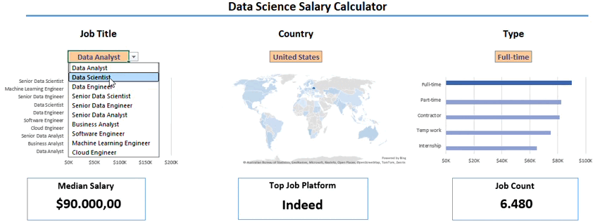

# Data Jobs Salary Dashboard

## 📌 Overview

This project is an interactive Excel dashboard designed to explore salary and employment trends across data-related roles.

The dashboard analyzes **32,000+ job records** and allows users to explore how salaries and job opportunities vary by job title, country, and employment type.

## 🎯 Project Goals

The dashboard was designed to answer questions such as:

- How do salaries vary across data-related roles?
- How does salary differ by country?
- How many job opportunities are available for a selected role?
- Which platforms contain the most job listings?
- How do salaries vary across employment types?
- How do different filters affect salary and job-market results?

## 📊 Dashboard Features

### Interactive Filters

Users can dynamically filter the dashboard by:

- **Job Title**
- **Country**
- **Employment Type**

The dashboard updates automatically based on the selected criteria.

### Key Performance Indicators

The dashboard displays three main KPIs:

- **Median Salary**
- **Top Job Platform**
- **Job Count**

### Salary by Job Title

Provides a comparison of salary levels across data-related roles, including positions such as Data Analyst, Data Scientist, Data Engineer, and other analytics and technology roles.

### Geographic Analysis

An interactive world map provides a geographic view of the selected job-market data.

### Employment Type Analysis

Compares salary information across employment types, including:

- Full-time
- Part-time
- Contractor
- Temporary work
- Internship

## 🛠 Tools & Techniques

- Microsoft Excel
- Power Query
- PivotTables
- PivotCharts
- XLOOKUP
- Data Validation
- Data Cleaning
- Data Analysis
- Data Visualization
- Interactive Dashboard Design

## 📁 Project Files

### Excel Dashboard

The complete interactive workbook is available here:

[`Salary_Dashboard.xlsx`](./Salary_Dashboard.xlsx)

> **Note:** For the best experience and full interactivity, download the workbook and open it in the desktop version of Microsoft Excel. Some Excel features may not be fully supported in browser-based previews.

### Dashboard Preview

The animated preview at the top of this README demonstrates how the dashboard responds to different selections.

## 👩‍💻 About This Project

This project is part of my data analytics portfolio and demonstrates my ability to transform a large dataset into an interactive analytical tool using Microsoft Excel.

It focuses on making job-market information easier to explore by combining data preparation, analysis, interactive filtering, KPI reporting, and data visualization in a single dashboard.
